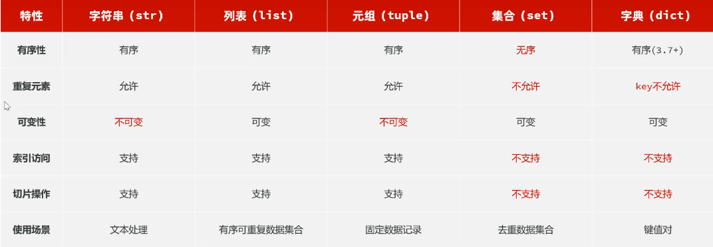

每天要形成的习惯是：
看视频
  ↓
跟着写一遍
  ↓
关闭视频独立重写
  ↓
运行验证
  ↓
git diff检查
  ↓
git commit保存

## 1—8：环境安装与入门程序

### 快捷键

快速注释  Ctrl+/

快速复制一行 Ctrl+D

新建一行 Ctrl+Enter

列选择模式  Alt + Shift + Insert

## 9—35：Python基础语法

基础数据类型：int,float,bool,str,NoneType

通过type()得到数据的类型，返回数据类型

通过isinstance(数据，类型) 判断数据是否是指定的类型，如果是：True，不是：False

### 字符串

字符串的三种定义：

s1 = "hello"
s2 = 'world'
s3 = """
hello
world
"""      可以换行，这个要按三次双引号


**转义字符\\'   \\"         \n（换行）   \t （缩进）   **制表符,\t 会把光标移动到下一个制表位

s4 = 'It\\'s very good'    要用转义字符，不然会忽略最后的'

print("hello\nworld")
print("hello\tworld")

字符串拼接

s1 = "hello"
s2 = "world"

print("Hi" +","+ s1 + "," + s2 + "!")


+号只能拼接字符串与字符串，如果要拼接其他类型数据和字符串，用str（数据）

print("大家好，我是"+name + ",今年" + age + "岁,学习的专业是" + major)
print("大家好，我是"+name + ",今年" + str(age) + "岁,学习的专业是" + major)


#字符串格式化  %s:占位符    **f"内容{变量/表达式}"**（企业推荐）
#通过%占位符 的形式完成字符串与变量的快速拼接

print("大家好，我是%s，今年%s岁，学习的专业是%s"% (name, age, major))
print(f"大家好，我是{name},今年{age}岁，学习的专业是{major}")
a = 10
b = 20
print(f"a+b = {a+b}")


### 输入与输出

#输入：input，**用法为：s = input（提示信息）  注意输入的数据一直都是字符串**
name = input("请输入你的姓名：")
print(f"欢迎你：{name}")
age = input("请输入你的你年龄：")
print(f"你的年龄是：{age}")
print(type(age))   #输出为<class 'str'>


print(f"你的余额是：{money**:.1f**}")   #表示保留一位小数

#案例银行卡中有10000元，现在去取款，根据输入的金额执行取钱操作，完成后展示余额
#步骤：1.输入密码  2.输入取款金额  3.计算余额并输出
balance = 10000
password = input("请输入您的密码：")
num = input("请输入取款金额：")
print(f"本次取款：{num}元，余额：{balance - **int(num)**}元")

```python
#打印一个长度为m 宽度为n的长方形
m = int(input("长方形的长为:"))
n = int(input("长方形的宽为:"))
for i in range(n):
    for j in range(m):
        print("*",end=" ")  #表示这个输出语句以" "结束,默认是"\n"(换行)
    print()
```

print()默认换行

### 运算符

  / 除法结果是小数  // 整除，结果是整数  %取余  **:幂指数：

```
10**3 = 10的3次方
```

#案例  要求输入两个数x，y，分别输出x+y和x-y
x = input("请输入x：")
y = input("请输入y：")
print(f"x+y={float(x)+float(y)}")
print(f"x-y={float(x)-float(y)}") #可能损失精度


逻辑运算符

#逻辑运算符  and   or    not  返回bool值
#案例 输入一个整数，判断是否在10~20
num = input("请输入一个数：")
print(int(num)>=10 and int(num)<=20)
print(10<=int(num)<=20)

#案例 输入一个整数，判断是否不在10~20
print(int(num)>=20 or int(num)<=10)

### 条件判断

#if判断格式   **python中是通过缩进来表示代码的层级关系**

if（条件）：             #注意冒号

​	操作

​	操作    #也是属于if代码块

操作    #不属于if代码块，独立运行

判断一个元素是否存在于列表:  元素   (not)  in   列表      

返回结果为bool值,True表示存在(不存在),False表示不存在(存在)

```python
#案例  完成登录功能（正确账号密码为1888/666888）
account = input("请输入您的账号：")
password = input("请输入您的密码：")
ok_account = "1888"
ok_password = "666888"

if account == ok_account and password == ok_password:
    print("登陆成功")
if account != ok_account or password != ok_password:
    print("登录失败")
```

#if...else...结构
if 条件：

​	操作

else:

​	操作


```python
#案例 根据输入的年份，判断是闰年还是平年  非整百且可以被4整除，整百必须被400整除才是闰年
year = input("请输入年份;")
if ( int(year) % 100 != 0 and int(year) % 4 == 0 ) or (int(year) % 100 ==0 and int(year) % 400 == 0 ):
    print("该年是闰年")
else:
    print("该年是平年")
```


简洁写法     **and优先级比or高**

```python
years = int(input("请输入年份："))
if years % 400 == 0 or years % 4 ==0 and years % 100 != 0:
    print("该年是闰年")
else:
    print("该年是平年")
```


#if...elif...else结构

if 条件1:

​	操作1

elif 条件2：

​	操作2

else：

​	操作3

#根据用户名 密码进行登录 用户名 密码分别为admin/666888,root/111111,zhangsan/123456,否则就提示用户名或密码错误

```python
name = input("输入用户名:")
password = input("输入密码:")
if name == "admin" and password == "666888":
    print("登陆成功")
elif name == "root" and password == "111111":
    print("登陆成功")
elif name == "zhangsan" and password == "123456":
    print("登陆成功")
else:
    print("用户名或密码错误")
```


### 模式匹配

match...case     匹配到会直接退出,不会继续往下

```python
day = int(input("今天是周几:"))
match day:
    case 1:
        print("今天是周一")
    case 2:
        print("今天是周二")
    case 3:
        print("今天是周三")
    case 4:
        print("今天是周四")
    case 5:
        print("今天是周五")
    case 6 | 7:
        print("今天是周末")
    **case _:**              #相当于else
        print("输入错误")
```

#实现一个计算器,可以实现+ - * / 运算,用户输入两个数以及运算符之后就可以进行运算

```python
a = float(input("a ="))
b = float(input("b ="))
s = input("s =")
match s:
    case "+":
        print(f"a+b={a} {s} {b} = {a+b}")
    case "-":
        print(f"a-b={a} {s} {b} = {a-b}")
    case "*":
        print(f"a*b={a} {s} {b} = {a*b}")
    case "/":
        if b == 0:
            print("除数不能为0")
        else:
            print(f"a/b={a} {s} {b} = {a/b}")

​	case _:
  	  print("运算符错误")
```


### 循环

while语法结构

while 条件:

​	循环语句1

​	循环语句2

​	...

else:                              #可有可无

​	条件为False,循环正常结束时运行       

```python
#案例计算1~100中的所有偶数和
n = 1
s = 0
while n <= 100:
    if n % 2 == 0:
        s += n
    n += 1
print(s)
```

for循环结构
for 元素 in 待处理数据集

​	循环体

else:

​	循环结束时执行的代码

```python
msg = "hello world"
for i in msg:
    print(i)
else:
    print("循环结束")
```

#### range语句

作用:生成指定规则的数字序列

用法1:range(end)      获取一个从0开始,到end结束的序列(不包含end)    range(5)->0,1,2,3,4

用法2:range(start,end)    获取一个从start开始,end结束的数字序列(不包含end)    range(2,8)->2,3,4,5,6,7

用法3:range(start,end,step)    获取一个从start开始,end结束的数字序列,step步长(不含end)    range(0,10,2)->0,2,4,6,8

```python
#计算100~500之间所有的3的倍数的数字之和
num =0
for i in range(100,501):
    if i % 3 == 0:
        num += i
print(num)
```

**while循环:用于某个条件满足时一直循环,循环次数未知,只知道开始和结束条件(关注循环的条件)**

**for循环:用于对已知的数据集进行遍历或已知次数的循环(关注的是遍历每一个元素)**

**break   只能用在循环中,表示跳出循环**

**continue 跳过本轮循环**

嵌套循环

```python
#打印一个长度为m 宽度为n的长方形
m = int(input("长方形的长为:"))
n = int(input("长方形的宽为:"))
for i in range(n):
    for j in range(m):
        print("*",end=" ")  #表示这个输出语句以" "结束,默认是"\n"(换行)
    print()
```

```python
#打印99乘法表
for i in range(1,10):
    for j in range(1,i+1):
        print(f"{j}*{i}={i*j}",end="\t")   #\t 会把光标移动到下一个制表位
    print()
```

```python
#登录
while True:
    account = input("输入账号:")
    password = input("输入密码:")

    if account == "" or password == "":
        print("用户名和密码不能为空,请重新输入")
        continue

    if account == "admin" and password == "666888" or account == "zhangsan" and password == "123456":
        print("登录成功")
        break
    print("用户名或密码错误,请重新输入")
```

## 36—56：数据容器

一种可以容纳多份数据的数据类型,容纳的每一份数据都称之为1个元素,每一个元素可以是任意类型的数据,如:字符串  数字  布尔等

列表(list)	字符串(str)	元组(tuple)	集合(set)	字典(dict)

### 列表--list

```python
#列表一次可以存储多个数据
#定义:  列表名称 = [元素1,元素2,元素3...]
#列表可以存储不同类型的元素  可以同时存int float bool str等
#元素有序,可以重复,元素可以修改
#索引:        s[0],s[1],s[2],s[3]
#支持反向索引: s[-4],s[-3],s[-2],s[-1]   从-1

s = [12,33,22,34,"a"]
print(s[0])
print(s[-5])  #都是12

#修改
s[4] = "b"
print(s)

#删除
del s[4]
print(s)

#遍历
for item in s:
    print(item)
```

#### 列表的切片

```python
#切片:对操作的数据截取其中一部分       列表,字符串,元组都支持切片
#语法:  序列数据[开始索引:结束索引:步长]
#包含开始索引对应的元素,不包含结束索引对应的元素,开始索引默认为0,结束索引未指定默认为列表长度,步长默认为1
#索引正向,反向都可以
s = ["a","b","c","d","e","f"]

l = s[:5]   #['a', 'b', 'c', 'd', 'e']
print(l)
l = s[5:]   #['f']
print(l)
l = s[:]    #['a', 'b', 'c', 'd', 'e', 'f']
print(l)
l = s[0:4:2]    #['a', 'c']
print(l)
l = s[5:1:-1]   #['f', 'e', 'd', 'c']  开始索引大于结束索引时步长需为负,此时从后往前遍历
print(l)
l = s[1:1]  #[]    开始索引和结束索引指向同一个时为空
print(l)
l = s[-6:-1]    #['a', 'b', 'c', 'd', 'e']
print(l)
l = s[-1:-6]  #[]
print(l)
l = s[0:-5]  #['a']
print(l)
```

### 列表的常用方法

```python
# append()   在列表尾部加元素  s.appen(10000)
# insert()   在指定索引前,插入该元素  s.insert(0,92)
# remove()   移除列表中第一个匹配到的值  s.remove(75)
# pop()      删除列表中指定索引位置的元素(如果未指引,默认最后一个)  s.pop(2)/s.pop()
# sort()     对列表元素进行排序(列表元素的数据类型一致,才可以进行排序)  s.sort()
# reverse()  反转列表元素  s.reserve()
# sum()      求和         sum(s)
# len()      数组中多少元素    len(s)
s = [11, 2, 31, 4, -5, 15, 17, 28]
print(s)    #[11, 2, 31, 4, -5, 15, 17, 28]
s.append(10)
print(s)    #[11, 2, 31, 4, -5, 15, 17, 28, 10]
s.insert(1,10)
print(s)    #[11, 10, 2, 31, 4, -5, 15, 17, 28, 10]
s.remove(10)
print(s)    #[11, 2, 31, 4, -5, 15, 17, 28, 10]
s.pop()
print(s)    #[11, 2, 31, 4, -5, 15, 17, 28]
s.sort()
print(s)    #[-5, 2, 4, 11, 15, 17, 28, 31]
s.reverse()
print(s)    #[31, 28, 17, 15, 11, 4, 2, -5]      
list1 = ['M', 'A', 'C', 'E', 'F', 'G', 'H', 'L', 'N', 'I', 'J', 'K', 'O']
list1.sort()
print(list1)#['A', 'C', 'E', 'F', 'G', 'H', 'I', 'J', 'K', 'L', 'M', 'N', 'O']
```

```py
#案例:将输入的10个数字,存储到一个列表中,并排序,输出其中的最小值,最大值和平均值
list1 = []
for i in range(10):
    num = int(input("输入一个数字:"))
    list1.append(num)
print(list1)
list1.sort()
print(list1)
print(f"最小值为:{list1[0]}")
print(f"最大值为:{list1[9]}")
print(f"最大值为:{list1[-1]}")

s = 0
for i in list1:
    s += i
print(f"平均值为:{s/10}")
print(f"平均值为:{sum(list1)/len(list1)}")
```

合并两个列表中的元素,并对合并后的结果进行去重**(三种合并方式)**

### 解包:将列表这一类容器解开成一个一个独立的元素   

new_list = [*num_list1, *num_list2]

判断一个元素是否存在于列表:  元素   (not)  in   列表      

返回结果为bool值,True表示存在(不存在),False表示不存在(存在)

```python
num_list1 = [19,23,54,64,875,20,109,232,123,54]
num_list2 = [55,80,72,35,60,123,54,29,91]
# new_list = [*num_list1, *num_list2]    三种合并方式,推荐前两种
# new_list = num_list1 + num_list2
new_list = num_list1
for i in num_list2:
    num_list1.append(i)

print("合并后的列表为:", new_list)
l = []
for num in new_list:
    if num not in l:
        l.append(num)
print(f"去重后的数组为:{l}")
```

### 列表推导式

生成1~20的平方列表

```python
#方法一
 l = []
 for i in range(1,21):
     l.append(i**2)
 print(l)
#方法二:列表推导式    按照一定的规则快速生成一个列表  语法格式:   [要插入的值 for  i  in 序列/列表]
num_list = [i**2 for i in range(1,21)]
print(num_list)
```

从如下数字列表中提取所有偶数,并计算其平方,组成新的列表

```python
#方法一:
num_list = [19,23,54,64,97,20,109,232,123,43,26,55,72]
l = []
for num in num_list:
    if num % 2 == 0:
        l.append(num**2)
print(l)
#方法二:列表推导式   [要插入的值 for  i  in 序列/列表 if 条件]
new_list = [ i**2 for i in num_list if i % 2 == 0]
print(new_list)
```

### 字符串

#字符串是字符的容器,一个字符串可以放任意数量的字符    如:"Python"  'Python'  """Python"""
#特点:不可变(无法修改)    有序性    可迭代性(可以通过for循环遍历)
#字符串中的每一个字符元素都有其对应的下标,支持正向  反向索引
#字符串切片    语法: 序列对象[开始索引:结束索引:步长]

```python
s = "hello-world"
print(s[4])
print(s[-1])

# s[4] = "x"   报错,不支持修改
# print(s[4])

for i in s:
    print(i)

#切片
print(s[1:5])
print(s[-1:-5:-1])
```

#### 字符串常用方法

```python
#find()     查找子串,返回第一次出现的索引位置,找不到返回-1      s.find('Python')
#count()    统计子串在字符串中出现的次数      s.count('H')
#upper()    将字符串中所有字母转换为大写      s.upper()
#lower()    将字符串中所有字母转换为小写      s.lower()
#split()    将字符串按指定分隔符分割为列表     s.split(' ')			不传参数的 split() 会自动处理连续空白。
#strip()    去除字符串两端的空白字符或指定字符   s.trip()/strip('s')   默认空格
#replace()  将字符串的指定子串替换为新的子串    s.replace('H','C')
#startswith()  检查字符串是否以指定子串开头,返回bool值   s.startswith('P')
#endswith()     检查字符串是否以指定子串结尾,返回bool值   s.endswith('P')

print(s.find('hello')) #0
print(s.count('l'))  #3
up_str = s.upper()
print(up_str)       #HELLO-WORLD
low_str = s.lower()
print(low_str)      #hello-world
l = s.split('-')
print(l)            #['hello', 'world']
ss = s.strip('l')
print(ss)           #hello-world
ss = " hello-world "
print(ss)           # hello-world
print(ss.strip())   #hello-world   把空格去除了
sss = s.replace('l','e')
print(sss)          #heeeo-wored
print(s.startswith('h'))    #True
print(s.endswith('e'))      #False

print(s)   #hello-world   字符串不会变
```

案例:邮箱格式验证:用户输入一个邮箱,验证邮箱格式是否正确(包含一个@和至少一个.),如果正确就输出"邮箱格式正确",否则输出"邮箱格式错误"

```python
email = input("请输入您的邮箱:")
# 方法一:
if email.count("@") == 1 and email.count(".") >= 1 :
    print("邮箱格式正确")
else:
    print("邮箱格式错误")

#方法二:    in
if email.count("@") == 1 and "." in email:
    print("邮箱格式正确")
else:
    print("邮箱格式错误")

```

​    练习1：输入一个字符串, 判断该字符串是否是回文(两边对称)

```python
s = input("输入一个字符串:")
#方法一:   双指针
flag = True
light = 0
right = len(s) -1
while light<right:
    if s[light]!=s[right]:
        flag = False
        break
    light+=1
    right-=1
if flag:
    print("该字符串回文")
else:
    print("该字符串不回文")

#方法二: 直接反转比较
if s == s[::-1]:
    print("该字符串回文")
else:
    print("该字符串不回文")
#方法三:  类似双指针  
num = 0     #len(s)   直接获取长度
for char in s:
    if char != "":
        num+=1
print(f"字符串长度为:{num}")
flag = True
for i in range(num):
    if s[i] != s[len(s)-1-i]:
        flag = False
if flag:
    print("该字符串回文")
else:
    print("该字符串不回文")
```

练习2：将用户输入的10个字符串, 反转后全部转换为大写, 然后记录在列表中, 最后将列表内容，遍历输出出来。

```python
s = []
for i in range(10):
    string = input("输入一个字符串:")
    s.append(string)      #s.append(string[::-1].upper())
    s[i] = s[i][::-1].upper()

for i in s:
    print(i)
```

### 元组

元组一旦创建不能修改
可以存储不同类型的元素
元素可以重复,有序,不可以修改,支持索引访问,切片
定义元组      元组名称 = (元素1,元素2...)
t1 = (1,5,6,9,6,4)
定义空元组	元组名称 = ()	t2 = ()
或者元组名称 = tuple()	t3 = tuple()
因为不能修改,所以只支持查询,统计操作
#count()  统计某元素出现的次数
#index()  查找某个元素在元组中的索引位置(第一次出现的位置)

```python
t1 = (1,5,6,9,6,4)
print(type(t1))     #<class 'tuple'>
print(t1[0])        #1
print(t1[-1])       #4

print(t1.count(6))  #2
print(t1.index(5))  #1

#切片
print(t1[1:4])  #(5, 6, 9)

#定义单个元素的元组   要在后面加逗号
t2 = (100)   #int
print(type(t2)) #<class 'int'>
t3 = (100,)     #tuple
print(type(t3))  #<class 'tuple'>
```

组包(Packing):将多个值合并到一个容器(元组或列表)中

解包(Unpacking):将容器(元组或列表)解开成独立的元素,分别赋值给多个变量

```python
#定义元组
t1 = (5,7,9,1)  #组包
t2 = 5,7,9,1    #组包
#基础解包
a,b,c,d = t1
print(a,b,c,d)  #5 7 9 1
# q,w,r = t1    #报错:too many values to unpack
# print(q,w,r)
# a,b,c,d,e = t1  #报错:not enough values to unpack
# print(a,b,c,d,e)
#(*)扩展解包   元组解包时, * 表示收集剩下的所有元素,生成列表
x,*y,z = t2    #x为5,y为[7,9],z为1
s, *o = t2      #s为5,o为[7,9,1]
*o, e = t2     #o为[5,7,9],e为1
```

案例1:现有两个变量,分别为a = 10, b = 20 现需要将两个变量值交换,然后输出

```python
a = 10
b = 20
# t = a,b
# b,a = t
#这两行可以简化为
a,b = b,a
print("b:",b)
print("a:",a)
```

案例2:现有三个变量,分别为a = 100, b = 200,c = 300, 现需要将三个变量值交换,将a,b,c的值分别赋给c,a,b然后输出

```python
a,b,c = 100,200,300
# t = a,b,c
# c,a,b = t
#简化为
c,a,b = a,b,c
print("c",c)
print("a",a)
print("b",b)
```

给定订单元组：

```
(
    ("A001", "键盘", 2, 199),
    ("A002", "鼠标", 3, 89),
    ("A003", "显示器", 1, 1299)
)
```

每条订单依次表示：订单号、商品名、数量、单价。遍历订单，输出每条订单的小计，最后输出全部订单总额。

```python
#解包,不依赖索引
orders = (
    ("A001", "键盘", 2, 199),
    ("A002", "鼠标", 3, 89),
    ("A003", "显示器", 1, 1299)
)

total = 0

for order_id, product_name, quantity, unit_price in orders:
    subtotal = quantity * unit_price
    print(f"{order_id}\t{product_name}\t小计：{subtotal}")
    total += subtotal

print(f"订单总额：{total}")
```

根据学生成绩单完成以下需求:

1.计算各个学生的总分,各科平均分,然后一并输出

2.统计各科成绩的最低分  最高分  平均分,并输出

3.查找成绩优秀(平均分>90)的学生,并输出

students =(
    ("S001","a",85,92,78),
    ("S002","b",92,88,95),
    ("S003","c",78,85,82),
    ("S004","d",88,79,91),
    ("S005","e",95,96,89),
    ("S006","f",76,82,77),
    ("S007","g",89,91,94),
    ("S008","h",75,69,82),
    ("S009","i",86,89,98),
    ("S010","j",66,59,72),
)

```python
# 1.计算各个学生的总分,各科平均分,然后一并输出
#方法一
# for stu in students:
#     print(f"学生{stu[1]}的总分为:{stu[2]+stu[3]+stu[4]}")
#     print(f"学生{stu[1]}的平均分为:{(stu[2]+stu[3]+stu[4])/3:.1f}")
#方法二
for uid,name,chinese_score,math_score,english_score in students:
    total = chinese_score + math_score + english_score
    avg = total /3
    print(f"学生{name}的总分为:{total}")
    print(f"学生{name}的平均分为:{avg}")
# 2.统计各科成绩的最低分  最高分  平均分,并输出

#获取成绩列表  简介写法  可以使用max(),min(),sum()
chinese_scores = [s[2] for s in students]
math_scores = [s[3] for s in students]
english_scores = [s[4] for s in students]
print(f"语文最低分为:{min(chinese_scores)},最高分为:{max(chinese_scores)},平均分为:{sum(chinese_scores)/len(chinese_scores):.1f}")
print(f"数学最低分为:{min(math_scores)},最高分为:{max(math_scores)},平均分为:{sum(math_scores)/len(math_scores):.1f}")
print(f"英语最低分为:{min(english_scores)},最高分为:{max(english_scores)},平均分为:{sum(english_scores)/len(english_scores):.1f}")
# chinese_min = students[0][2]
# chinese_max = students[0][2]
# math_min = students[0][3]
# math_max = students[0][3]
# english_min = students[0][4]
# english_max = students[0][4]
# chinese_sum =0
# math_sum = 0
# english_sum = 0
# for stu in students:
#     if stu[2] < chinese_min:
#         chinese_min = stu[2]
#     if stu[3] < math_min:
#         math_min = stu[3]
#     if stu[4] < english_min:
#         english_min = stu[4]
#     if stu[2] > chinese_max:
#         chinese_max = stu[2]
#     if stu[3] > math_max:
#         math_max = stu[3]
#     if stu[4] > english_max:
#         english_max = stu[4]
#     chinese_sum+=stu[2]
#     math_sum+=stu[3]
#     english_sum+=stu[4]
# chinese_avg = chinese_sum / len(students)
# math_avg = math_sum / len(students)
# english_avg = english_sum / len(students)
# print(f"语文最低分为:{chinese_min},最高分为:{chinese_max},平均分为:{chinese_avg:.1f}")
# print(f"数学最低分为:{math_min},最高分为:{math_max},平均分为:{math_avg:.1f}")
# print(f"英语最低分为:{english_min},最高分为:{english_max},平均分为:{english_avg:.1f}")
# 3.查找成绩优秀(平均分>90)的学生,并输出
#写法一:
# for stu in students:
#     if (stu[2]+stu[3]+stu[4])/3 > 90:
#         print(f"{stu[1]}的成绩优秀,学号为:{stu[0]},平均分为:{(stu[2]+stu[3]+stu[4])/3:.1f}")
#写法二:
for uid,name,chinese_score,math_score,english_score in students:
    total = chinese_score + math_score + english_score
    avg = total /3
    if avg > 90:
        print(f"学号:{uid},姓名:{name},平均分:{avg:.1f}")
```

### 集合

集合(set)是**无序,不可重复(重复元素自动去重),可修改**的数据容器

```python
#定义
s1 = {"c","d","e"}
#空集合
s2 = set()      #不可以使用{},{}表示的是空字典,由于集合是无序的,因此不支持小标索引
```

#### 常用方法

| add()        | 添加元素到集合                                      | s.add('t')          |
| ------------ | --------------------------------------------------- | ------------------- |
| remove()     | 移除集合中指定元素(不存在则报错)                    | s.remove('t')       |
| pop()        | 随机删除集合中的元素并返回                          | e = s.pop()         |
| clear()      | 清空集合                                            | s.clear()           |
| difference() | 求两个集合的差集(第一个集合有,第二个集合没有的元素) | s1.difference(s2)   |
| union()      | 求两个集合的并集                                    | s1.union(s2)        |
| intersection | 求两个集合的交集                                    | s1.intersection(s2) |

```python
s1 = {100,200,300,400,500,600,700,800}
s1.add(1200)
print(s1)       #{800, 100, 200, 300, 400, 1200, 500, 600, 700}

s1.remove(200)
print(s1)       #{800, 100, 300, 400, 1200, 500, 600, 700}

e = s1.pop()
print(e)        #800
print(s1)       #{100, 300, 400, 1200, 500, 600, 700}

s1.clear()
print(s1)       #set()

s2 = {"A","B","C","D","E","X","Y"}
s3 = {"C","E","Y","Z"}
print(s2.difference(s3))        #{'B', 'D', 'A', 'X'}
print(s2.union(s3))             #{'Y', 'D', 'Z', 'A', 'X', 'B', 'E', 'C'}
print(s2.intersection(s3))      #{'E', 'Y', 'C'}
```

#### 集合推导式     快速构建集合,语法:    {要往集合中添加的元素   for s in set if 条件}

&表示交集    |表示并集	-表示差集

案例:
选修足球学生名单

football_set = {"王林", "曾牛", "徐立国", "遁天", "天运子", "韩立", "厉飞雨", "乌丑", "紫灵"}

选修篮球学生名单

basketball_set = {"张铁", "墨居仁","王林", "姜老道", "曾牛", "王蝉", "韩立", "天运子", "李化元", "厉飞雨", "云露"}

选修法语学生名单

french_set = {"许木", "王卓", "十三", "虎咆", "姜老道", "天运子",  "红蝶", "厉飞雨", "韩立", "曾牛"}

选修艺术学生名单

art_set = { "遁天", "天运子", "韩立", "虎咆", "姜老道", "紫灵"}

1.找出同时选择了法语和艺术的学生

2.找出同时选择所有四门课程的学生
3.找出选择了足球,但是没有选择篮球的学生
4.统计每一个学生的课程数量

```python
# 选修足球学生名单
football_set = {"王林", "曾牛", "徐立国", "遁天", "天运子", "韩立", "厉飞雨", "乌丑", "紫灵"}
# 选修篮球学生名单
basketball_set = {"张铁", "墨居仁","王林", "姜老道", "曾牛", "王蝉", "韩立", "天运子", "李化元", "厉飞雨", "云露"}
# 选修法语学生名单
french_set = {"许木", "王卓", "十三", "虎咆", "姜老道", "天运子",  "红蝶", "厉飞雨", "韩立", "曾牛"}
# 选修艺术学生名单
art_set = { "遁天", "天运子", "韩立", "虎咆", "姜老道", "紫灵"}
#1.找出同时选择了法语和艺术的学生  &也可以表示交集&
print(f"同时选择了法语和艺术的学生:{french_set.intersection(art_set)}")
print(f"同时选择了法语和艺术的学生:{french_set & art_set}")

#2.找出同时选择所有四门课程的学生
print(f"同时选择所有四门课程的学生:{football_set.intersection(basketball_set).intersection(french_set).intersection(art_set)}")
print(f"同时选择所有四门课程的学生:{football_set & basketball_set & french_set & art_set}")

#3.找出选择了足球,但是没有选择篮球的学生  -(减号)也可以表示差集
print(f"找出选择了足球,但是没有选择篮球的学生:{football_set.difference(basketball_set)}")
print(f"找出选择了足球,但是没有选择篮球的学生:{football_set - basketball_set}")
#还可以通过集合推导式     快速构建集合,语法:    {要往集合中添加的元素   for s in set if 条件}
s1 = {s for s in football_set if s not in basketball_set}
print(f"找出选择了足球,但是没有选择篮球的学生:{s1}")

#4.统计每一个学生的课程数量
# name = football_set.union(basketball_set).union(art_set).union(french_set)
#也可以用  |表示并集
name = football_set | basketball_set | french_set | art_set
#因为集合中元素不能重复,因此可以用列表   解包操作
all_list = [*football_set, *basketball_set, *french_set, *art_set]
for n in name:
    print(f"{n}选择的课程数量为:{all_list.count(n)}")
#笨方法
# for n in name:
#     num = 0
#     if n in football_set:
#         num += 1
#     if n in basketball_set:
#         num += 1
#     if n in art_set:
#         num += 1
#     if n in french_set:
#         num += 1
#     print(f"{n}选择的课程数量为:{num}")
```

### 字典

字典(dict),里面存储的是键值对(key: value)类型的数据,可以根据键(key)找到对应的值(value)
特点:以键值对(key: value)形式存储   键(key)不能重复,可修改
注意:字典(dict)中的value可以是任何类型的数据,而key不能为可变类型(如:列表,集合,字典),不可变类型有int,float,string,tuple

```python
#定义:    字典名称 = {key: value,key: value,key: value...}
#key不能重复,如果重复不会报错,但后面的会把前面的覆盖
dict1 = {"a": 1, "b": 2, "c": 3, "a": 4}
print(dict1)        #{'a': 4, 'b': 2, 'c': 3}
print(type(dict1))  #<class 'dict'>
dict1 = {(1,2): 1, 100: 2, 3.14: 3, "a": 4}
print(dict1)        #{(1, 2): 1, 100: 2, 3.14: 3, 'a': 4}    不可变类型有int,float,string,tuple
# dict1 = {[1,2]: 1, 100: 2, 3.14: 3, "a": 4}   报错:cannot use 'list' as a dict key  因为list是可变类型

#定义空字典  字典名称 = {}   字典名称 = dict()
dict2 = {}
dict3 = dict()
print(dict2)        #{}
print(type(dict2))  #<class 'dict'>
print(dict3)        #{}
print(type(dict3))  #<class 'dict'>

#根据key获取value
print(dict1["a"])      #4
dict1["a"] = 100
print(dict1["a"])       #100   可以修改
```

#### 常用操作

| 类型 |          操作           |                    含义                    |         样例         |
| :--: | :---------------------: | :----------------------------------------: | :------------------: |
| 添加 |  字典名称[key] = value  |           往指定字典中添加键值对           |   dict1["a"] = 10    |
| 删除 |    字典名称.pop(key)    | 删除字典中指定的key,并返回该key对应的value | num = dict1.pop("a") |
| 删除 |   del   字典名称[key]   |              删除指定的键值对              |  del    dict1["a"]   |
| 修改 | 字典名称[key]  =  value |           修改指定的key对应的值            |   dict1["a"] = 100   |
| 查询 |      字典名称[key]      |              根据key获取value              |      dict1["a"]      |
| 查询 |    字典名称.get(key)    |              根据key获取value              |    dict1.get("a")    |
| 查询 |     字典名称.keys()     |               获取所有的key                |     dict1.keys()     |
| 查询 |    字典名称.values()    |              获取所有的value               |    dict1.values()    |
| 查询 |    字典名称.items()     |         获取所有的key-value键值对          |    dict1.items()     |

```python
dict1 = {"a": 1, "b": 2, "c": 3, "d": 4}
#查询
print(dict1.get("c"))       #3
print(dict1["c"])           #3

print(dict1.keys())         #dict_keys(['a', 'b', 'c', 'd'])
print(dict1.values())       #dict_values([1, 2, 3, 4])
print(dict1.items())        #dict_items([('a', 1), ('b', 2), ('c', 3), ('d', 4)])

#删除
num = dict1.pop("c")        #有返回值
print(num)                  #3
print(dict1)                #{'a': 1, 'b': 2, 'd': 4}

del dict1["d"]              #无返回值
print(dict1)                #{'a': 1, 'b': 2}

#遍历
for k in dict1.keys():
    print(f"{k}: {dict1[k]}")       #a: 1  (中间换行) b: 2
for item in dict1.items():          #item是元组('a', 1)    ('b', 2)
    print(f"{item[0]}: {item[1]}")  #a: 1  (中间换行) b: 2
for k, v in dict1.items():          #解包然后遍历
    print(f"{k}: {v}")              #a: 1  (中间换行) b: 2
```

案例
开发购物车管理系统,实现商品信息的增删改查功能,系统使用字典结构存储商品数据,通过控制台菜单与用户交互,具体功能如下
1.添加购物车:用户根据提示录入商品名称以及该商品的价格,数量保存该商品信息到购物车
2.修改购物车:要求用户输入要修改的购物车商品名称,然后再提示输入该商品的价格,数量,输入完成后修改该商品信息
3.删除购物车:要求用户输入要删除的购物车名称,根据名称删除购物车中的商品
4.查询购物车:将购物车中的商品信息展示除了,格式为:"商品名称: xxx,商品价格: xxx,商品数量: xxx"
5.退出购物车

```python
#购物车数据
#shopping_cart = {"商品1":{"price":200,"num":2},"商品2":{"price":100,"num":1}...}
shopping_cart = {}
#控制台菜单
print("##########购物车系统##########")
print("#        1.添加购物车        #")
print("#        2.修改购物车        #")
print("#        3.删除购物车        #")
print("#        4.查询购物车        #")
print("#        5.退出购物车        #")
print("############################")
valid_choose = ["1", "2", "3", "4", "5"]

while True:
    choose = input("请选择要执行的操作(1~5):")
    if choose not in valid_choose:
        choose = input("输入无效,请输入1~5:")
        continue
    match choose:
        #添加购物车功能
        case "1":
            name = input("请输入要录入的商品:")
            if name not in shopping_cart.keys():
                price = float(input("请输入该商品价格:"))
                num = int(input("请输入购买数量:"))
                shopping_cart[name] = {"price": price, "num": num}
            else:
                print("该商品已存在")
            choose = input("请选择要执行的操作(1~5):")
            if choose not in valid_choose:
                choose = input("输入无效,请输入1~5:")
        #修改购物车
        case "2":
            name = input("请输入要修改的商品:")
            if name in shopping_cart.keys():
                price = float(input("请输入该商品价格:"))
                num = int(input("请输入购买数量:"))
                shopping_cart[name] = {"price": price, "num": num}
            else:
                print("该商品不存在")
            choose = input("请选择要执行的操作(1~5):")
            if choose not in valid_choose:
                choose = input("输入无效,请输入1~5:")
        #删除购物车
        case "3":
            name = input("请输入要删除的商品:")
            if name in shopping_cart.keys():
                del shopping_cart[name]
                print(f"{name}已删除")
                print(f"当前购物车:{shopping_cart}")
            choose = input("请选择要执行的操作(1~5):")
            if choose not in valid_choose:
                choose = input("输入无效,请输入1~5:")
        case "4":
            #查询购物车
            for name,msg in shopping_cart.items():
                print(f"商品名称:{name},商品价格:{msg.get("price")},商品数量为:{msg.get("num")}")
            choose = input("请选择要执行的操作(1~5):")
            if choose not in valid_choose:
                choose = input("输入无效,请输入1~5:")
        case "5":
            print("已退出系统")
            break
```

### 数据容器总结



开发一个教务管理系统，在该系统中可以维护和管理学员的成绩信息，具体需求如下：
1. 添加学生信息：根据提示录入学生姓名、语文、数学、英语成绩，录入完成保存到系统中。
2. 修改学生信息：要求输入要修改的学生姓名，然后再提示输入语文、数学、英语成绩，输入完成后修改学员信息。
3. 删除学生信息：要求输入要删除的学生姓名，根据姓名删除学生信息。
4. 查询学生信息：要求输入要查询的学生姓名，根据姓名查询学生信息并输出。
5. 列出所有学生：遍历所有学生信息并输出。
6. 统计班级成绩：统计班级语文、数学、英语成绩的最高分、最低分、平均分，以及语文、数学、英语最高分和最低分的学员姓名。
7. 退出系统。

```python
students_msg = {}
menu = """
########################################[菜单]##############################################################
#  1. 添加学生信息  2. 修改学生信息  3. 删除学生信息  4. 查询学生信息  5. 列出所有学生  6. 统计班级成绩  7. 退出系统     #
###########################################################################################################

请选择要执行的操作(1~7):
"""
# 修改1：不在菜单循环外长期保存统计列表。
# 统计功能每次都从 students_msg 重新取数，避免修改、删除学生后仍保留旧成绩。

while True:
    choose = input(menu)

    match choose:
        case "1":
            # 1. 添加学生信息
            # 修改2：去除姓名首尾空格，并拒绝空姓名。
            name = input("请输入学生姓名:").strip()
            if name == "":
                print("学生姓名不能为空")
                continue
            if name in students_msg:
                print("该学生已存在")
            else:
                # 修改3：验证三科成绩，只接受 0~100 的整数。
                score_values = []
                for subject in ("语文", "数学", "英语"):
                    while True:
                        score_text = input(f"请输入{subject}成绩:")
                        if score_text.isdigit() and 0 <= int(score_text) <= 100:
                            score_values.append(int(score_text))
                            break
                        print("成绩无效，请输入0~100的整数")

                chinese_score, math_score, english_score = score_values
                students_msg[name] = {"chinese_score": chinese_score, "math_score": math_score, "english_score": english_score}
                print(f"学生{name}添加完成")

        case "2":
            # 2. 修改学生信息
            name = input("请输入要修改的学生姓名:").strip()
            if name == "":
                print("学生姓名不能为空")
                continue
            if name not in students_msg:
                print("该学生不存在")
            else:
                # 修改4：修改成绩时使用与添加功能相同的验证规则。
                score_values = []
                for subject in ("语文", "数学", "英语"):
                    while True:
                        score_text = input(f"请输入{subject}成绩:")
                        if score_text.isdigit() and 0 <= int(score_text) <= 100:
                            score_values.append(int(score_text))
                            break
                        print("成绩无效，请输入0~100的整数")

                chinese_score, math_score, english_score = score_values
                students_msg[name] = {"chinese_score": chinese_score, "math_score": math_score, "english_score": english_score}
                print(f"学生{name}修改完成")
        case "3":
            # 3. 删除学生信息
            name = input("请输入要删除的学生姓名:").strip()
            if name == "":
                print("学生姓名不能为空")
                continue
            if name not in students_msg:
                print("该学生不存在")
            else:
                del students_msg[name]
                print(f"学生{name}信息删除成功")
        case "4":
            # 4. 查询学生信息
            name = input("请输入要查询的学生姓名:").strip()
            if name == "":
                print("学生姓名不能为空")
                continue
            if name not in students_msg:
                print("该学生不存在")
            else:
                # 修改5：使用中文字段展示查询结果，不直接暴露内部键名。
                score = students_msg[name]
                print(
                    f"姓名:{name}, "
                    f"语文:{score['chinese_score']}, "
                    f"数学:{score['math_score']}, "
                    f"英语:{score['english_score']}"
                )
        case "5":
            # 5. 列出所有学生
            if not students_msg:
                print("当前没有学生信息")
            else:
                print(f"{'姓名':<8}{'语文':<6}{'数学':<6}{'英语':<6}")

                # 修改6：只使用一层 items() 遍历，保证姓名与成绩来自同一条记录。
                for name, score in students_msg.items():
                    print(
                        f"{name:<10}"
                        f"{score['chinese_score']:<8}"
                        f"{score['math_score']:<8}"
                        f"{score['english_score']:<8}"
                    )

        case "6":
            # 6. 统计班级成绩：统计班级语文、数学、英语成绩的最高分、最低分、平均分，以及语文、数学、英语最高分和最低分的学员姓名
            # 修改7：空字典不能调用 max() 和 min()，先进行空数据判断。
            if not students_msg:
                print("当前没有学生，无法统计成绩")
                continue

            # 修改8：每次统计时从当前字典重新生成列表，不保留历史数据。
            chinese_scores = [score["chinese_score"] for score in students_msg.values()]
            math_scores = [score["math_score"] for score in students_msg.values()]
            english_scores = [score["english_score"] for score in students_msg.values()]

            chinese_max = max(chinese_scores)
            chinese_min = min(chinese_scores)
            math_max = max(math_scores)
            math_min = min(math_scores)
            english_max = max(english_scores)
            english_min = min(english_scores)

            # 修改9：找出所有并列最高分和最低分的学生，不再只返回第一人。
            chinese_max_names = [name for name, score in students_msg.items() if score["chinese_score"] == chinese_max]
            chinese_min_names = [name for name, score in students_msg.items() if score["chinese_score"] == chinese_min]
            math_max_names = [name for name, score in students_msg.items() if score["math_score"] == math_max]
            math_min_names = [name for name, score in students_msg.items() if score["math_score"] == math_min]
            english_max_names = [name for name, score in students_msg.items() if score["english_score"] == english_max]
            english_min_names = [name for name, score in students_msg.items() if score["english_score"] == english_min]

            print(
                f"语文最高分:{chinese_max},姓名:{chinese_max_names}, "
                f"最低分:{chinese_min},姓名:{chinese_min_names}, "
                f"平均分:{sum(chinese_scores) / len(chinese_scores):.1f}"
            )
            print(
                f"数学最高分:{math_max},姓名:{math_max_names}, "
                f"最低分:{math_min},姓名:{math_min_names}, "
                f"平均分:{sum(math_scores) / len(math_scores):.1f}"
            )
            print(
                f"英语最高分:{english_max},姓名:{english_max_names}, "
                f"最低分:{english_min},姓名:{english_min_names}, "
                f"平均分:{sum(english_scores) / len(english_scores):.1f}"
            )
        case "7":
            # 7. 退出系统
            print("系统已退出")
            break

        # 修改10：为菜单增加默认分支，输入其他内容时给出明确提示。
        case _:
            print("输入无效，请输入1~7")
```
